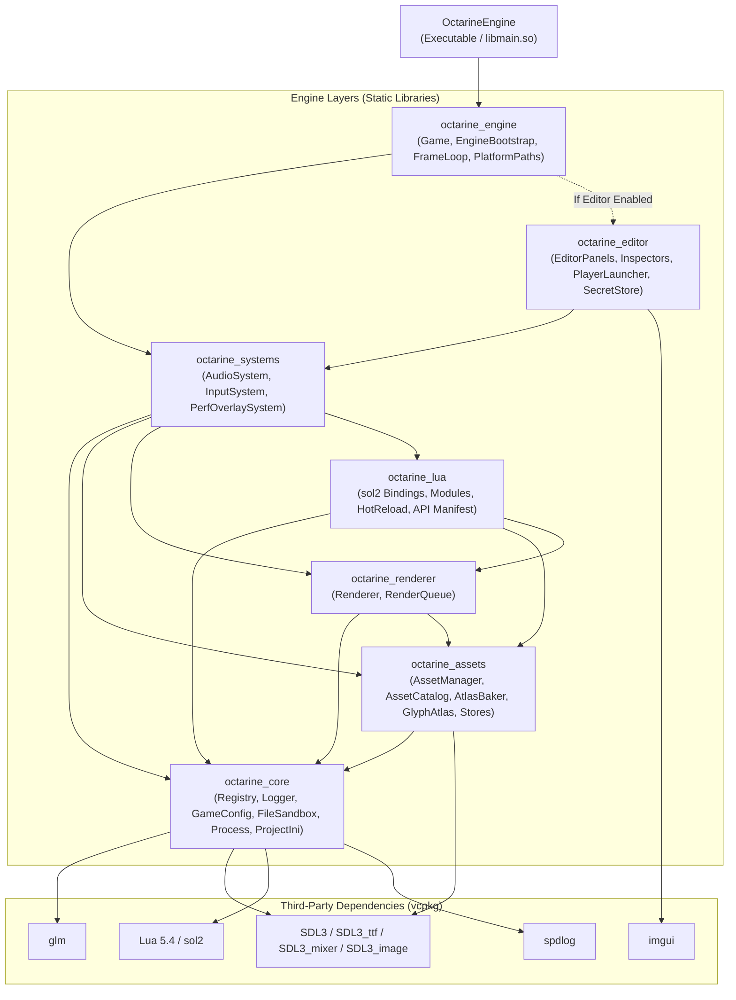
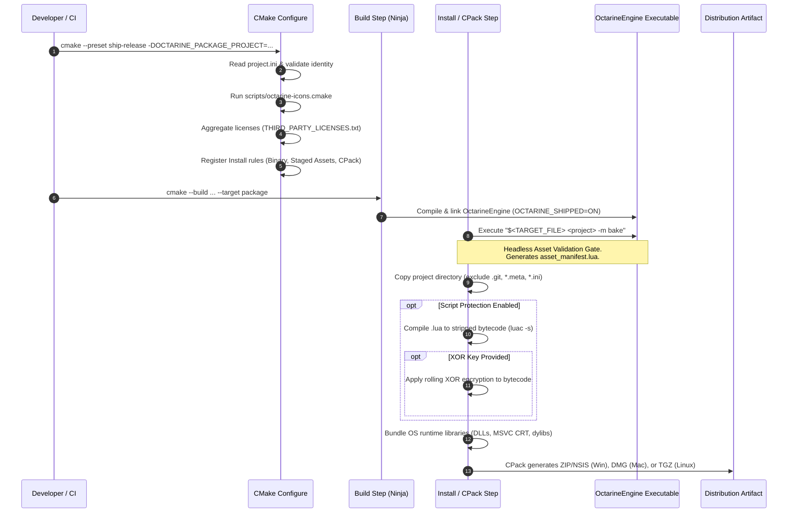
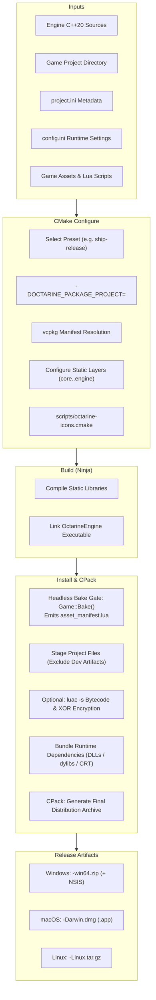

# Octarine Engine — CMake Build System Architecture

This document provides a comprehensive, detailed breakdown of the Octarine Engine build system. It explains the design philosophy, layer architecture, build presets, packaging pipeline, and how all components interact to produce developer tools, debug players, and shippable release artifacts across desktop platforms (Windows, Linux, macOS).

---

## Table of Contents

1. [Architectural Overview & Philosophy](#1-architectural-overview--philosophy)
2. [Source & Build Layout](#2-source--build-layout)
3. [Configuration Options & Compile Defines](#3-configuration-options--compile-defines)
4. [Build Presets & Target Matrix](#4-build-presets--target-matrix)
5. [Modular Engine Layers (`src/CMakeLists.txt`)](#5-modular-engine-layers-srccmakeliststxt)
6. [vcpkg Dependency Management & Toolchains](#6-vcpkg-dependency-management--toolchains)
7. [The Desktop Packaging Pipeline (`cmake/OctarinePackage.cmake`)](#7-the-desktop-packaging-pipeline-cmakeoctarinepackagecmake)
8. [The Runtime Asset Contract & Discovery Model](#8-the-runtime-asset-contract--discovery-model)
9. [Summary Flowchart](#9-summary-flowchart)

---

## 1. Architectural Overview & Philosophy

Octarine Engine uses modern CMake (version 3.15+) and C++20. The build system is designed around several core principles:

1. **Unified Engine Binary & Bundle Model**:
   Whether running in the editor, dev player, or a standalone release game, the engine runs from the same core C++ codebase. The difference between development and shipping lies in feature flags (`OCTARINE_WITH_EDITOR`, `OCTARINE_WITH_IMGUI`, `OCTARINE_SHIPPED`) rather than separate code forks.
2. **Layered Static Libraries**:
   The engine codebase under `src/` is decomposed into distinct, unidirectional static libraries (`octarine_core` → `octarine_assets` → `octarine_renderer` → `octarine_lua` → `octarine_systems` → `octarine_editor` → `octarine_engine`). This enforces clean architectural boundaries and maximizes incremental rebuild parallelism.
3. **Binary Asset Manifests Over Filesystem Scans**:
   During active development, the asset catalog live-scans the project directory for fast iteration. In shipped builds (`OCTARINE_SHIPPED`), the scan is replaced by loading a pre-baked `asset_manifest.lua`. This allows the engine to run out of read-only bundles (such as macOS `.app` bundles, Windows packaged dirs, or Android APKs).
4. **Self-Contained Deliverables**:
   Shipped games need to launch without requiring command-line arguments (such as `-p /path/to/game`). The packaging pipeline bundles the engine binary, runtime dependencies, and the staged project assets in a platform-native layout where `SDL_GetBasePath()` resolves the game data automatically.
5. **Compiler Caching & Link-Time Optimization (LTO)**:
   Compiler caching via `ccache` or `sccache` is automatically detected and enabled for fast iterative compilation. Non-debug configurations enable Interprocedural Optimization (IPO/LTO) and selective section dead-stripping (`--gc-sections` on ELF, `-dead_strip` on Mach-O) to discard unused symbols from statically linked libraries (e.g. SDL3, Lua).

---

## 2. Source & Build Layout

The build system is organized into modular CMake files and scripts:

```
Octarine-Engine/
├── CMakeLists.txt                # Root project definition, global flags, exe target, tests/benchmarks
├── CMakePresets.json             # Standardized developer and release presets
├── vcpkg.json                    # Package manifest for C++ dependencies
├── cmake/
│   ├── octarine_library.cmake    # Standardized compiler flags, warnings, and PIC setup helper
│   ├── OctarinePackage.cmake     # Desktop packaging orchestration (install, bake gate, CPack)
│   ├── octarine-licenses.cmake   # Aggregation of engine and third-party dependency licenses
│   ├── vcpkg-toolchain.cmake     # Discovery wrapper for vcpkg CMake toolchain
│   └── vcpkg-overlay-triplets/   # Custom triplets (e.g. universal-osx.cmake)
├── scripts/
│   ├── octarine-icons.cmake      # Icon and splash generator script
│   ├── octarine-icon-tool/       # Native host helper for resizing and assembling iconsets
│   └── octarine-init-build.sh    # Scaffolds build-desktop and build-android scripts into projects
└── src/
    ├── CMakeLists.txt            # Definition of internal layered static libraries
    └── Main.cpp                  # Entry point for desktop and Android
```

---

## 3. Configuration Options & Compile Defines

The root [`CMakeLists.txt`](CMakeLists.txt) provides several cache variables to control compilation:

| Option | Default | Description |
|---|---|---|
| `CMAKE_BUILD_TYPE` | `Debug` | Standard CMake configuration (`Debug`, `Release`, `RelWithDebInfo`, `MinSizeRel`). |
| `OCTARINE_WITH_EDITOR` | `ON` | Compiles the yellowish-purple editor environment. Forces `OCTARINE_WITH_IMGUI=ON`. |
| `OCTARINE_WITH_IMGUI` | `ON` | Compiles Dear ImGui and debugging overlays. |
| `OCTARINE_ENABLE_PROFILING` | `OFF` | Enables per-system timing instrumentation via `PerfUtils.h`. |
| `OCTARINE_SHIPPED` | `OFF` | Gating define: switches asset catalog from filesystem scanning to pre-baked `asset_manifest.lua`. Forced `ON` in shipping presets and packaging. |
| `OCTARINE_PACKAGE_PROJECT` | `""` | Path to a game project directory. When non-empty, includes [`OctarinePackage.cmake`](cmake/OctarinePackage.cmake) to produce a shippable packaged game. |
| `OCTARINE_USE_CCACHE` | `ON` | Automatically detects `ccache` or `sccache` and sets `CMAKE_CXX_COMPILER_LAUNCHER`. |
| `OCTARINE_NATIVE_ARCH` | `OFF` | When `ON`, compiles with `-march=native`. When `OFF`, defaults to `-march=x86-64-v3` on x86_64 for portability across end-user CPUs. |
| `OCTARINE_SANITIZE` | `OFF` | Enables sanitizers (`OFF`, `asan` for ASan+UBSan, or `tsan` for ThreadSanitizer). |
| `OCTARINE_ENABLE_TESTS` | `OFF` | Builds test targets and registers CTest unit/smoke tests. |
| `OCTARINE_ENABLE_BENCHMARKS` | `OFF` | Builds Google Benchmark microbenchmarks. |
| `OCTARINE_PROTECT_SCRIPTS` | `${OCTARINE_SHIPPED}` | Compiles staged Lua scripts to stripped bytecode (`luac -s`). |
| `OCTARINE_LUA_XOR_KEY` | `""` | Optional uint8 key (e.g. `0x5A`) to encrypt compiled bytecode. |
| `OCTARINE_PACKAGE_NSIS` | `OFF` | On Windows, also emits an NSIS executable installer in addition to a `.zip`. |

---

## 4. Build Presets & Target Matrix

Standard workflows are codified in [`CMakePresets.json`](CMakePresets.json). All presets inherit from a hidden `base` preset using the `Ninja` generator and outputting to `build/${presetName}`.

### Presets Overview

| Preset Name | Build Type | Editor | ImGui | Shipped Flag | Target Output Name | Primary Purpose |
|---|---|---|---|---|---|---|
| `editor-debug` | `Debug` | ON | ON | OFF | `OctarineEngine` | Day-to-day engine and game development with full editor UI. |
| `editor-release` | `Release` | ON | ON | OFF | `OctarineEngine` | Optimized editor for complex scenes or release profiling in editor. |
| `player-debug` | `Debug` | OFF | ON | OFF | `OctarineEngine-player` | Fast testing of game logic with ImGui debug overlays available. |
| `player-profile` | `RelWithDebInfo` | OFF | OFF | OFF | `OctarineEngine-player` | Profiling game logic with zero editor/ImGui overhead. |
| `player-release` | `Release` | OFF | OFF | OFF | `OctarineEngine-player` | High-performance dev player; live-scans asset filesystem for fast iteration. |
| `ship-release` | `Release` | OFF | OFF | **ON** | `OctarineEngine` | **Shippable release artifact**. Skips filesystem scans; loads baked `asset_manifest.lua`. |
| `ship-mac-universal` | `Release` | OFF | OFF | **ON** | `OctarineEngine` | macOS universal binary (`arm64` + `x86_64`) for running on Apple Silicon and Intel. |

### Binary Naming Invariant
Notice the binary naming rule in root [`CMakeLists.txt`](CMakeLists.txt#L203-L208):
- If `OCTARINE_WITH_EDITOR=OFF` and `OCTARINE_SHIPPED=OFF` (development players), the executable is named `OctarineEngine-player`. This prevents clobbering the editor binary so both can coexist in the same dev tree.
- If `OCTARINE_WITH_EDITOR=ON` or `OCTARINE_SHIPPED=ON`, the executable keeps its canonical name `OctarineEngine`.

---

## 5. Modular Engine Layers (`src/CMakeLists.txt`)

The engine source is divided into several layered static libraries defined in [`src/CMakeLists.txt`](src/CMakeLists.txt). Standard flags, warning levels, and PIC (Position Independent Code) are applied across all libraries via the `octarine_library()` helper defined in [`cmake/octarine_library.cmake`](cmake/octarine_library.cmake).



### Layer Responsibilities

1. **`octarine_core`**:
   Foundational data structures, entity component system ([`Registry.cpp`](src/ECS/Registry.cpp)), logging ([`Logger.cpp`](src/General/Logger.cpp)), configuration loading ([`GameConfig.cpp`](src/Game/GameConfig.cpp)), INI parsing, sandboxed file operations, and platform path helpers.
2. **`octarine_assets`**:
   Texture, font, and audio resource stores. Asset catalog building, runtime asset references, hot-reloading, and texture/glyph atlas bakers (using vendored `stb` headers with warning suppressions).
3. **`octarine_renderer`**:
   Wraps SDL3 GPU/SDL_Renderer rendering, manages render queues, sorting keys, and draw call batching.
4. **`octarine_lua`**:
   Binds engine subsystems and ECS components to Lua via `sol2`. Implements sandboxed Lua modules (`storage.*`, `project.*`, `assets.*`), script hot-reloading, and EmmyLua API stub generation.
5. **`octarine_systems`**:
   Per-frame updates and event-driven systems (audio playback, input dispatch, performance overlay).
6. **`octarine_editor`** *(gated by `OCTARINE_WITH_EDITOR` or `OCTARINE_WITH_IMGUI`)*:
   Editor UI panels (asset browser, inspector, hierarchy, console, build dialog), hot pusher dev client, and platform-specific credential storage ([`SecretStore`](src/Secrets/)).
7. **`octarine_engine`**:
   Top-level lifecycle coordinator ([`Game.cpp`](src/Game/Game.cpp), [`EngineBootstrap.cpp`](src/Engine/EngineBootstrap.cpp), [`FrameLoop.cpp`](src/Engine/FrameLoop.cpp)). Pulls in all underlying libraries transitively.
8. **`${PROJECT_NAME}` (`OctarineEngine`)**:
   Top-level executable declared in the root `CMakeLists.txt` compiling [`src/Main.cpp`](src/Main.cpp) and linking `octarine_engine`. On Android, this target compiles as a shared library (`libmain.so`).

---

## 6. vcpkg Dependency Management & Toolchains

Dependencies are managed in **vcpkg manifest mode** via [`vcpkg.json`](vcpkg.json).

### Toolchain Discovery ([`cmake/vcpkg-toolchain.cmake`](cmake/vcpkg-toolchain.cmake))
The toolchain wrapper resolves `vcpkg.cmake` dynamically without hardcoding local system paths:
1. Environment variables (`VCPKG_ROOT`, `VCPKG_INSTALLATION_ROOT`).
2. Local CLion bundled vcpkg directories (`~/.vcpkg-clion/...`).
3. User home default installations (`~/vcpkg/...`).

### Overlays
- **Ports (`vcpkg-overlay-ports/`)**:
  Contains specialized ports such as `sol2-imgui-bindings` (prebuilt, binary-cached Dear ImGui Lua bindings).
- **Triplets (`cmake/vcpkg-overlay-triplets/`)**:
  Contains `universal-osx.cmake` which drives multi-architecture builds (`arm64;x86_64`) on macOS by compiling and lipo'ing fat static libraries.

---

## 7. The Desktop Packaging Pipeline (`cmake/OctarinePackage.cmake`)

When `-DOCTARINE_PACKAGE_PROJECT=<path>` is supplied, the packaging pipeline activates. It configures CMake's install rules and CPack to generate a self-contained release package.



### Packaging Stages in Detail

#### 1. Identity Resolution & Validation
- [`project.ini`](project.ini) located at the root of the game project is parsed into key-value pairs.
- Values are resolved with strict precedence:
  $$\text{CLI Override} > \text{project.ini} > \text{Built-in Default}$$
- In shipping builds (`OCTARINE_SHIPPED=ON`), required fields are validated:
  - `name`: Must be present.
  - `version_name`: Must be present (SemVer format).
  - `package_id`: Must be reverse-DNS (e.g. `com.studio.mygame`). Failure to match causes a fatal configuration error.

#### 2. Icon Generation
[`scripts/octarine-icons.cmake`](scripts/octarine-icons.cmake) is invoked to generate OS-specific icon formats from the source 1024×1024 PNG specified by `icon=`:
- **Windows**: Multi-resolution `.ico` embedded into the executable and CPack NSIS installer.
- **macOS**: `.icns` file placed into `Contents/Resources/` and set via `MACOSX_BUNDLE_ICON_FILE`.
- **Linux**: 256×256 `.png` placed alongside the binary for `.desktop` integration.

#### 3. License Aggregation
[`cmake/octarine-licenses.cmake`](cmake/octarine-licenses.cmake) gathers the engine license, embedded font attributions (e.g. Roboto-Medium Apache-2.0), vcpkg library licenses, and any project-specific drop-ins located in `<project>/THIRD_PARTY_LICENSES.d/`. An aggregated `THIRD_PARTY_LICENSES.txt` is installed into the release package.

#### 4. The Headless Asset Bake Gate
Before staging files, an `install(CODE ...)` step runs the newly built engine binary headless against the project:
```sh
$<TARGET_FILE:OctarineEngine> "<PROJECT_DIR>" -m bake
```
- `Game::Bake()` initializes SDL with subsystems disabled (`SDL_Init(0)`), loads `config.ini`, parses all scenes, scripts, and asset references, and verifies their existence on disk.
- It writes `asset_manifest.lua` directly into the project directory.
- **CI Gate**: If any asset is missing, corrupted, or unresolvable, `Game::Bake` returns a non-zero exit code, aborting the install and packaging process immediately.

#### 5. Project Staging
The project directory is copied to the bundle data directory using `install(DIRECTORY)` with exclusions for development-only and temporary files:
- Excluded: `.git`, `.gitignore`, `*.meta`, `editor_prefs.ini`, `preferences.ini`, `imgui.ini`, `*.bak`.

#### 6. Script Protection & Encryption
If `OCTARINE_PROTECT_SCRIPTS` is enabled (default in `OCTARINE_SHIPPED` builds):
- Installed `.lua` files are compiled to stripped bytecode using `luac -s` (removing local variable names and line numbers to impede reverse engineering).
- If `OCTARINE_LUA_XOR_KEY` is specified, the bytecode is encrypted using a rolling XOR key and tagged with a 4-byte magic header (`\x1bOCT`). The engine binary is compiled with the matching key to transparently decrypt scripts upon loading.

#### 7. Runtime Library Bundling
- **Windows**: Discovers and copies all runtime DLLs from vcpkg. Automatically searches the active MSVC toolset directory to bundle the Microsoft Visual C++ Redistributable runtime DLLs (`msvcp140.dll`, `vcruntime140.dll`, etc.).
- **macOS**: Sets `INSTALL_RPATH` to `@executable_path/../Frameworks`, creates `Contents/Frameworks/`, and copies all dependent dylibs.
- **Linux**: Sets `INSTALL_RPATH` to `$ORIGIN` and bundles dynamic `.so` dependencies alongside the executable.

#### 8. CPack Packaging
CPack is configured to emit native archive formats:
- **Windows**: Portable `.zip` archive (plus `.exe` installer if `OCTARINE_PACKAGE_NSIS` is ON).
- **macOS**: Drag-and-drop `.dmg` disk image containing the `.app` bundle.
- **Linux**: Portable `.tar.gz` archive.

---

## 8. The Runtime Asset Contract & Discovery Model

When an end-user runs a packaged Octarine game, execution follows a zero-configuration path:

1. **Base Path Discovery**:
   - `Main.cpp` starts without requiring command-line parameters.
   - `PlatformPaths::ApplyDefaultBasePath(effectivePath)` calls `SDL_GetBasePath()`:
     - **Windows / Linux**: Returns the directory containing the binary (`./`).
     - **macOS**: Returns `<AppName>.app/Contents/Resources/`.
2. **Config Loading**:
   - `GameConfig::LoadConfigFromFile(effectivePath)` opens `config.ini` from that base directory via SDL title storage.
3. **Manifest-Driven Asset Loading**:
   - Because `OCTARINE_SHIPPED` was defined at compile time, `AssetCatalog` skips all filesystem directory walks.
   - It directly loads `asset_manifest.lua`, mapping pre-indexed asset IDs to relative paths.
   - This ensures fast startup times and prevents crashes when operating in read-only filesystems or sandboxed environments.

---

## 9. Summary Flowchart


